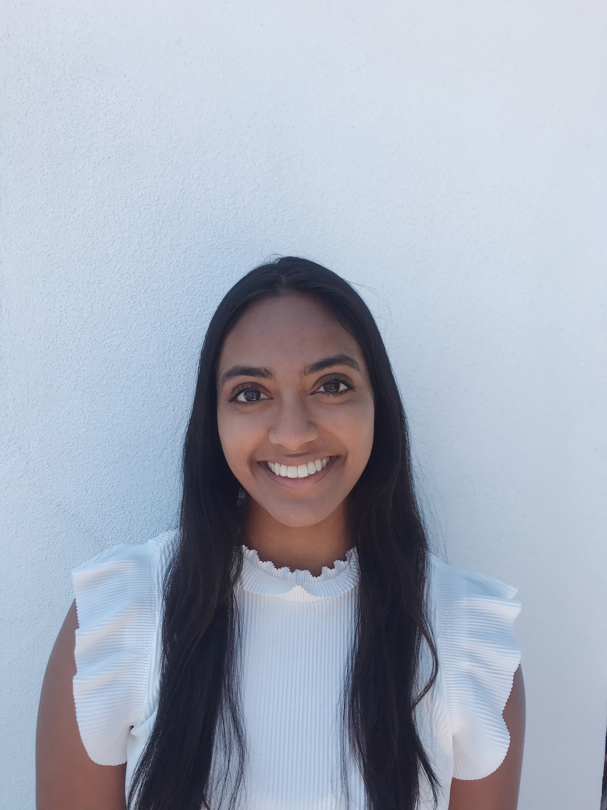

# **Welcome to my personal GitHub page!**

You can look at my [repository on GitHub](https://github.com/harshiagrawal/harshiagrawal.github.io-cse110-lab1/) to check out what files and branches I have created.

## **A little bit about me:**

My name is Harshi Agrawal, and I am a 3rd year Computer Science student at UCSD. As part of my extracurriculars on campus, I am a social chair member on Women in Computing's board. I am also an employee on campus at Canyonview Aquatic Center and in Delta Gamma. Outside of school, these are some of the activities I *really* enjoy doing:

- Traveling
- Hiking
- Going to the beach
- Cooking
- Spending time with friends and family
- Caligraphy

However, if I had to rank these in order from my most favorite to lease favorite thing to do, here is what it would be:

1. Spending time with friends and family
2. Traveling
3. Going to the beach
4. Cooking
5. Hiking
6. Caligraphy

### [**Women in Computing:**](https://wic.ucsd.edu/?fbclid=IwAR0ThnW8J6fKlp9n6EyYNDtAxD44_ZZNPlwqYrFDZ6Exz4Jwpj_aSI5vbKw#)

I love being part of WIC on campus, so I wanted to go more in depth about it. Something I am **_very_** passionate about is diversity, especially in the tech industry. Being a woman ***AND*** a minority in this field, I strive to inspire other young women to not be intimidated. I want to be a part of a community that understands what it is like to be in a minority group and be able to support one another in this journey. Women in Computing has allowed me to do that. I ~~like~~ love to talk to others and give advice on how to get internships, how to network, and how to be successful in your career.

As Coco Chanel once said: 
> A girl should be two things: who and what she wants.

As a part of board, I decided to take part in redesigning and coding the website over the summer. It allowed me to learn front end languages such as JavaScript and practice git commands such as `git status` or `git add .`. It also gave me the opportunity to bond more with my fellow board members who had also volunteered, so it was overall a great experience.

### **Delta Gamma:**

I am also part of a sorority on campus, and I joined Fall 2020. Some of Delta Gamma's values that really stood out to me were the following:

* Professionalism
  - I really care about my future and being successful in my career. I want to be supported by other strong, smart women who can share these values along with me.
    - In terms of my career, I hope to eventually become a product manager in the tech industry.
* Friendship
  - I hope to make lifelong friends and make meaningful connections.
* Promote cultural interests
  - Supporting diversity and different cultures is very important in my life, and with this value of Delta Gamma, it made me that much more passionate about joining their member class.
  
### **Future Goals:**

I do have some goals for myself both in my personal and professional life. Some of these goals have been met but include this list:

- [x] Get an internship for summer 2021
- [ ] Workout at least 5 times a week
- [ ] Network with more Product Managers
- [ ] Try to maintain a 3.8 GPA
- [ ] Travel to a new country in 2021 (if the pandemic gets better)
